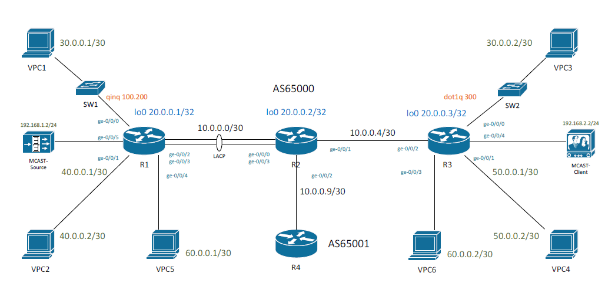
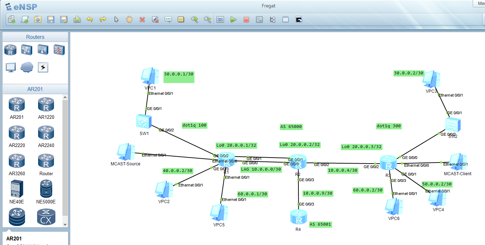
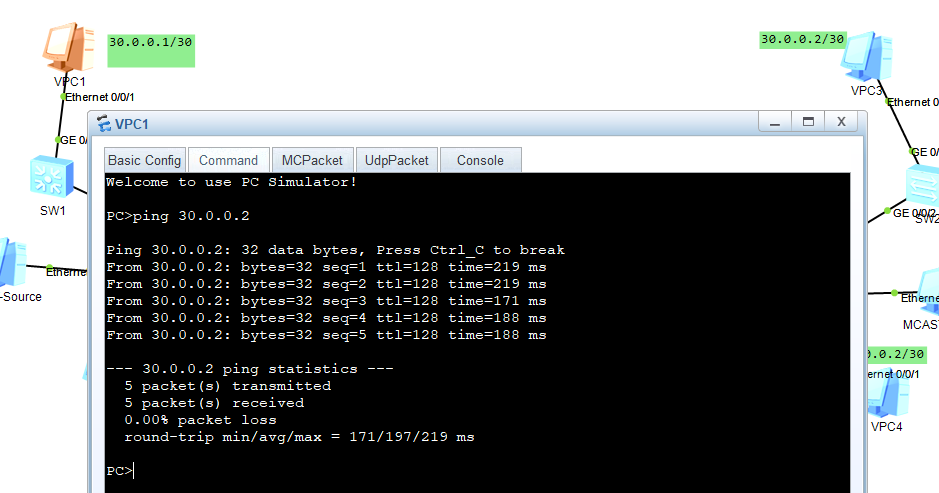
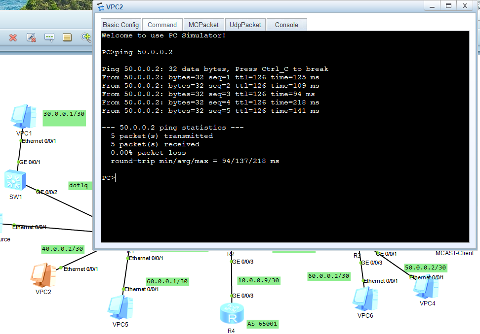
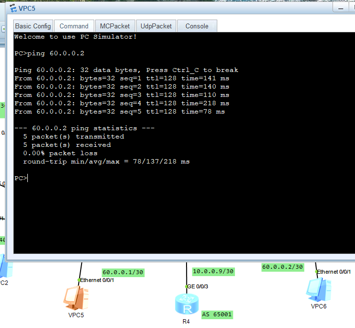

### Тестовое задание

  

### Лабораторный стенд

  

### Конфигурация оборудования  

[R1](../FregatA/Configs/R1.txt)  
[R2](../FregatA/Configs/R2.txt)  
[R3](../FregatA/Configs/R3.txt)  
[R4](../FregatA/Configs/R4.txt)  
[SW1](../FregatA/Configs/SW1.txt)  
[SW2](../FregatA/Configs/SW2.txt)  

### 1. Между R1 и R2 настроить LAG с LACP.  
Перенесем ip адресацию на оборудование и создадим Eth-Trunk1.  

R1 dis int eth-tr1  
Eth-Trunk1 current state : UP  
Line protocol current state : UP    
Last line protocol up time : 2025-10-14 21:01:46 UTC-08:00  
Description:  
Route Port,Hash arithmetic : According to flow,Maximal BW: 2G, Current BW: 2G, T
he Maximum Transmit Unit is 1500  
Internet Address is 10.0.0.1/30  
IP Sending Frames' Format is PKTFMT_ETHNT_2, Hardware address is 5489-98be-1520   
Physical is ETH_TRUNK  
Current system time: 2025-10-14 21:13:27-08:00  
    Last 300 seconds input rate 3048 bits/sec, 0 packets/sec  
    Last 300 seconds output rate 14352 bits/sec, 1 packets/sec  
    Realtime 0 seconds input rate 0 bits/sec, 0 packets/sec  
    Realtime 0 seconds output rate 0 bits/sec, 0 packets/sec  
    Input: 598 packets,280166 bytes  
           274 unicast,0 broadcast,324 multicast  
           0 errors,0 unknownprotocol  
    Output:1396 packets,1242281 bytes  
           281 unicast,1 broadcast,1114 multicast  
           0 errors  
    Input bandwidth utilization  :    0%  
    Output bandwidth utilization :    0%  
 
PortName                      Status      Weight  

GigabitEthernet0/0/0          UP          1  
GigabitEthernet0/0/1          UP          1  

The Number of Ports in Trunk : 2  
The Number of UP Ports in Trunk : 2  

### 2. Настроить в качестве внутреннего протокола маршрутизации ISIS.  

Настраиваем NET запись на всех роутерах и добавлем ISIS на NNI интерфейсы.  
isis 100  
 network-entity 49.0001.0200.0000.0001.00  

L1L2 соседство установлено, есть обмен маршрутной информацией:

 R2 dis isis peer

                         Peer information for ISIS(100)  

  System Id     Interface          Circuit Id       State HoldTime Type     PRI  

router_R1       Eth-Trunk1         router_R1.01      Up   9s       L1(L1L2) 64   
router_R1       Eth-Trunk1         router_R1.01      Up   9s       L2(L1L2) 64   
router_R3       GE0/0/2            router_R2.02      Up   22s      L1(L1L2) 64   
router_R3       GE0/0/2            router_R2.02      Up   23s      L2(L1L2) 64   

Total Peer(s): 4  

R1>dis isis route 

                        Route information for ISIS(100)
                        -------------------------------

                       ISIS(100) Level-1 Forwarding Table
                       ----------------------------------

IPV4 Destination     IntCost    ExtCost ExitInterface   NextHop         Flags  

10.0.0.0/30          10         NULL    Eth-Trunk1      Direct          D/-/L/-  
192.168.2.0/24       30         NULL    Eth-Trunk1      10.0.0.2        A/-/L/-  
192.168.1.0/24       10         NULL    Eth0/0/0        Direct          D/-/L/-  
10.0.0.4/30          20         NULL    Eth-Trunk1      10.0.0.2        A/-/L/-  
20.0.0.3/32          20         NULL    Eth-Trunk1      10.0.0.2        A/-/L/-  
20.0.0.2/32          10         NULL    Eth-Trunk1      10.0.0.2        A/-/L/-  
20.0.0.1/32          0          NULL    Loop0           Direct          D/-/L/-  
     Flags: D-Direct, A-Added to URT, L-Advertised in LSPs, S-IGP Shortcut,
                               U-Up/Down Bit Set

                       ISIS(100) Level-2 Forwarding Table
                      

IPV4 Destination     IntCost    ExtCost ExitInterface   NextHop         Flags  
 
10.0.0.0/30          10         NULL    Eth-Trunk1      Direct          D/-/L/-  
192.168.2.0/24       30         NULL     
192.168.1.0/24       10         NULL    Eth0/0/0        Direct          D/-/L/-  
10.0.0.4/30          20         NULL     
20.0.0.3/32          20         NULL     
20.0.0.2/32          10         NULL     
20.0.0.1/32          0          NULL    Loop0           Direct          D/-/L/-  

### 3. Настройть BGP с номером AS 65000.  
Настройки на R1 и R3 аналогичны  
bgp 65000  
 router-id 20.0.0.1  
 peer 20.0.0.3 as-number 65000  
 peer 20.0.0.3 connect-interface LoopBack0  
 
 ipv4-family unicast  
  network 20.0.0.1 255.255.255.255  
  peer 20.0.0.3 enable  

[R1]dis bgp peer  

 BGP local router ID : 20.0.0.1  
 Local AS number : 65000  
 Total number of peers : 1		  Peers in established state : 1  

  Peer            V          AS  MsgRcvd  MsgSent  OutQ  Up/Down       State PrefRcv  

  20.0.0.3        4       65000       64       73     0 00:48:30 Established      3  

  [R1]dis bgp routing-table peer 20.0.0.3 advertised-routes  

 BGP Local router ID is 20.0.0.1   
 Total Number of Routes: 1  
      Network            NextHop        MED        LocPrf    PrefVal Path/Ogn  

 *>   20.0.0.1/32        20.0.0.1        0          100        0      i  

[R1]dis bgp routing-table peer 20.0.0.3 received-routes   

 BGP Local router ID is 20.0.0.1 
 Total Number of Routes: 3  
      Network            NextHop        MED        LocPrf    PrefVal Path/Ogn  

 *>i  10.0.0.4/30        20.0.0.3        0          100        0      ?  
   i  20.0.0.3/32        20.0.0.3        0          100        0      i  
 *>i  192.168.2.0        20.0.0.3        0          100        0      ?  

 Связность в iBGP между R1 и R3 установлена, обмен префиксами есть.  

### 4. Между VPC1 И VPC3 настроить псевдопровод (VPWS LDP). Коммутаторы SW1 и SW2 уже настроены, их трогать не надо. На R1 трафик приходит в qinq с метками 100 и 200, на R3 в dot1q с меткой 300.

На всех роутерах включаем глобально mpls и настраиваем lsr-id  
sysname R2  
mpls lsr-id 20.0.0.2  
mpls  

Включаем протокол ldp  глобально и на NNi интерфейсах   
mpls ldp  

На R1 и R2 yастраиваем удаленный хост и привязываем псевдопровод к сабинтерфейсу 
mpls ldp remote-peer 20.0.0.3  
 remote-ip 20.0.0.3    

interface GigabitEthernet0/0/2.100  
 vlan-type dot1q 100  
 mpls l2vc 20.0.0.3 100  

Результат: псевдопровод в состоянии UP и успешный обмен пакетами между VPC1 и VPC3  

[R1]dis mpls l2vc  
 Total LDP VC : 1     1 up       0 down   

 *client interface     : GigabitEthernet0/0/2.100 is up  
  Administrator PW     : no  
  session state        : up  
  AC status            : up  
  VC state             : up  
  Label state          : 0  
  Token state          : 0  
  VC ID                : 100  
  VC type              : VLAN  
  destination          : 20.0.0.3  
  
  create time          : 0 days, 1 hours, 49 minutes, 0 seconds  
  up time              : 0 days, 0 hours, 3 minutes, 25 seconds  
  last change time     : 0 days, 0 hours, 3 minutes, 25 seconds  
  VC last up time      : 2025/10/14 22:47:10  
  VC total up time     : 0 days, 1 hours, 48 minutes, 6 seconds  

  [R1] dis mpls ldp peer   
 
 LDP Peer Information in Public network  
 A '*' before a peer means the peer is being deleted.    
 
 PeerID                 TransportAddress   DiscoverySource  
  
 20.0.0.2:0             20.0.0.2           Eth-Trunk1  
 20.0.0.3:0             20.0.0.3           Remote Peer : 20.0.0.3  
 
 TOTAL: 2 Peer(s) Found.

   

### 5. Между VPC2 и VPC4 настроить L3VPN.   

Настраиваем MP-iBGP между R1 и R3   
 ipv4-family vpnv4  
    peer 20.0.0.3 enable  

  Конфигурируем vpn-instance, RT и RD   
ip vpn-instance FregatA  
 ipv4-family  
  route-distinguisher 100:1  
  vpn-target 100:1 export-extcommunity  
  vpn-target 100:1 import-extcommunity    
ipv4-family vpn-instance FregatA    
  import-route direct    

Привязываем vpn-instance к интерфейсу  
interface GigabitEthernet0/0/3  
 ip binding vpn-instance FregatA  
 ip address 40.0.0.1 255.255.255.252  

Проверяем vpn-instance FregatA:  
 [R1]dis ip vpn-instance verbose  
 Total VPN-Instances configured : 1  

 VPN-Instance Name and ID : FregatA, 1  
  Interfaces : GigabitEthernet0/0/3    
 Address family ipv4  
  Create date : 2025-10-14 21:01:35-08:00    
  Up time : 0 days, 02 hours, 26 minutes and 53 seconds  
  Route Distinguisher : 100:1  
  Export VPN Targets :  100:1  
  Import VPN Targets :  100:1  
  Label Policy : label per route  
  The diffserv-mode Information is : uniform     
  The ttl-mode Information is : pipe  
  Log Interval : 5  

  

Результат: успешный обмен пакетами между VPC2 и VPC4  

### 6. Между VPC5 и VPC6 настроить VPLS (BGP).  
Создать VPLS BGP не удалось. В данной версии eNSP в секции l2vpn-ad-family нет команды signaling vpls или peer signaling vpls. Vsi находится в состоянии down.  
Выполнил L2VPN VPLS на протоколе LDP.  

Создаем виртуальный коммутатор c сигнализацией на ldp, указываем id и ip удаленного хоста  

vsi TEST  
 pwsignal ldp  
  vsi-id 555  
  peer 20.0.0.3 
 
Привязываем vsi к интерфейсу  
interface Ethernet0/0/1   
 l2 binding vsi TEST  

[R1]dis vsi name TEST  
Vsi                             Mem    PW   Mac       Encap     Mtu   Vsi       
Name                            Disc   Type Learn     Type      Value State     

TEST                            --     ldp  unqualify vlan      1500  up   

     

### 7. Между R2 и R4 настроить EBGP. На R2 применить политику на импорт, которая будет для маршрутов с community 65001:1,65001:2 применять local-preference 200.  Для маршрутов с community 65001:100 добавлять community 65000:200. R4 настроен, его трогать не надо.  
Настраиваем EBGP между R2 и R4 
bgp 65000  
 router-id 20.0.0.2  
 peer 10.0.0.10 as-number 65001

 bgp 65001  
 router-id 20.0.0.4  
 peer 10.0.0.9 as-number 65000 

Создаем список сообществ на R2 
ip community-filter 1 permit 65001:1  
ip community-filter 2 permit 65001:2  
ip community-filter 3 permit 65001:100  

Создаем route-map BGP_INPUT на R2  
route-policy BGP_INPUT permit node 10  
 if-match community-filter 1  
 apply local-preference 200  
route-policy BGP_INPUT permit node 20  
 if-match community-filter 2  
 apply local-preference 200  
route-policy BGP_INPUT permit node 30  
 if-match community-filter 3  
 apply community 65000:200 additive  

Применяем route-map BGP_INPUT на R2
 ipv4-family unicast
  peer 10.0.0.10 enable
  peer 10.0.0.10 route-policy BGP_INPUT import

### 8. Настроить PIM/IGMP, что бы мультикаст поток с адресом 224.0.2.12 (источник 192.168.1.2) доходил до клиента (адрес 192.168.2.2). Источник и клиент уже настроены, их трогать не надо.
На всех роутерах включаем глобально маршрутизацию мультикаст трафика multicast routing-enable и протокол PIM.    

На всех интерфейсах включаем сжатый режим pim dm.  

На клиентском интерфейсе R3 Ethernet0/0/0 включам протокол igmp для присоединения к мульткастовой группе.  

igmp enable
 igmp static-group 224.0.2.12 source 192.168.1.2

Проверяем на R3:  
[R3]dis pim neighbor   
 VPN-Instance: public net  
 Total Number of Neighbors = 1  

 Neighbor        Interface           Uptime   Expires  Dr-Priority  BFD-Session  
 10.0.0.5        GE0/0/2             00:52:27 00:01:20 1            N  

 [R3]dis igmp group 224.0.2.12 static   
Static join group information of VPN-Instance: public net   
 Total 1 entry  
 Total 1 entry matched, Total 1 active entry  
  Group Address   Source Address  Interface             State     Expires      
  224.0.2.12      192.168.1.2     Eth0/0/0              UP        never   

  R3 успешно подключился к мультикастовой группе 224.0.2.12

