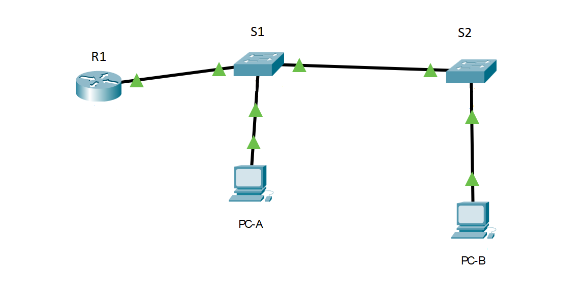
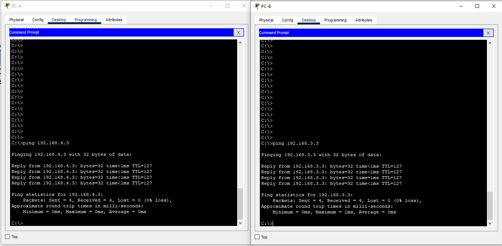

# VLAN и маршрутизация между VLAN

схема лабораторного стенда, выполненного на cisco packet tracer

 Конфигурация [R1](configR1.txt)

 Конфигурация [S1](configS1.txt)

  Конфигурация [S2](configS2.txt)
  

## Trubleshooting R1

R1#show arp
Protocol  Address          Age (min)  Hardware Addr   Type   Interface
Internet  192.168.3.3             107 0000.0CD0.AD5D  ARPA   GigabitEthernet0/0/1.3
Internet  192.168.3.11            67  000A.F388.5201  ARPA   GigabitEthernet0/0/1.3
Internet  192.168.3.12            99  0001.9611.0201  ARPA   GigabitEthernet0/0/1.3
Internet  192.168.4.3             72  0001.9617.752C  ARPA   GigabitEthernet0/0/1.4

R1#show ip route 

     192.168.3.0/24 is variably subnetted, 2 subnets, 2 masks
C       192.168.3.0/24 is directly connected, GigabitEthernet0/0/1.3
L       192.168.3.1/32 is directly connected, GigabitEthernet0/0/1.3
     192.168.4.0/24 is variably subnetted, 2 subnets, 2 masks
C       192.168.4.0/24 is directly connected, GigabitEthernet0/0/1.4
L       192.168.4.1/32 is directly connected, GigabitEthernet0/0/1.4

R1#  show ip int br
Interface              IP-Address      OK? Method Status                Protocol 
GigabitEthernet0/0/0   unassigned      YES unset  administratively down down 
GigabitEthernet0/0/1   unassigned      YES unset  up                    up 
GigabitEthernet0/0/1.3 192.168.3.1     YES manual up                    up 
GigabitEthernet0/0/1.4 192.168.4.1     YES manual up                    up 
GigabitEthernet0/0/1.8 unassigned      YES unset  up                    up 
GigabitEthernet0/0/2   unassigned      YES unset  administratively down down 
Vlan1                  unassigned      YES unset  administratively down down

## Trubleshooting S1

S1# show vlan br

VLAN Name                             Status    Ports
---- -------------------------------- --------- -------------------------------
1    default                          active    
3    VLAN0003                         active    Fa0/6
4    VLAN0004                         active    
7    ParkingLot                       active    Fa0/2, Fa0/3, Fa0/4, Fa0/7
                                                Fa0/8, Fa0/9, Fa0/10, Fa0/11
                                                Fa0/12, Fa0/13, Fa0/14, Fa0/15
                                                Fa0/16, Fa0/17, Fa0/18, Fa0/19
                                                Fa0/20, Fa0/21, Fa0/22, Fa0/23
                                                Fa0/24, Gig0/1, Gig0/2
8    VLAN0008                         active    
1002 fddi-default                     active    
1003 token-ring-default               active    
1004 fddinet-default                  active    
1005 trnet-default                    active 

S1#show int trunk 
Port        Mode         Encapsulation  Status        Native vlan
Fa0/1       on           802.1q         trunking      8
Fa0/5       on           802.1q         trunking      8

Port        Vlans allowed on trunk
Fa0/1       3-4,8
Fa0/5       3-4,8

Port        Vlans allowed and active in management domain
Fa0/1       3,4,8
Fa0/5       3,4,8

Port        Vlans in spanning tree forwarding state and not pruned
Fa0/1       3,4,8
Fa0/5       3,4,8

## Trubleshooting S2

S2#show vlan br

VLAN Name                             Status    Ports
---- -------------------------------- --------- -------------------------------
1    default                          active    
3    Management                       active    
4    Operators                        active    Fa0/18
7    ParkingLot                       active    Fa0/2, Fa0/3, Fa0/4, Fa0/5
                                                Fa0/6, Fa0/7, Fa0/8, Fa0/9
                                                Fa0/10, Fa0/11, Fa0/12, Fa0/13
                                                Fa0/14, Fa0/15, Fa0/16, Fa0/17
                                                Fa0/19, Fa0/20, Fa0/21, Fa0/22
                                                Fa0/23, Fa0/24, Gig0/1, Gig0/2
8    VLAN0008                         active    
1002 fddi-default                     active    
1003 token-ring-default               active    
1004 fddinet-default                  active    
1005 trnet-default                    active  
  
S2#show int tr
Port        Mode         Encapsulation  Status        Native vlan
Fa0/1       on           802.1q         trunking      8

Port        Vlans allowed on trunk
Fa0/1       3-4,8

Port        Vlans allowed and active in management domain
Fa0/1       3,4,8

Port        Vlans in spanning tree forwarding state and not pruned
Fa0/1       3,4,8

## Итог работы:
успешный обмен пакетами между PC из разных влан 
