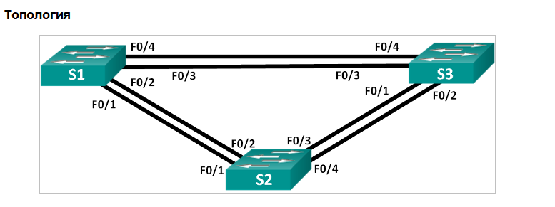
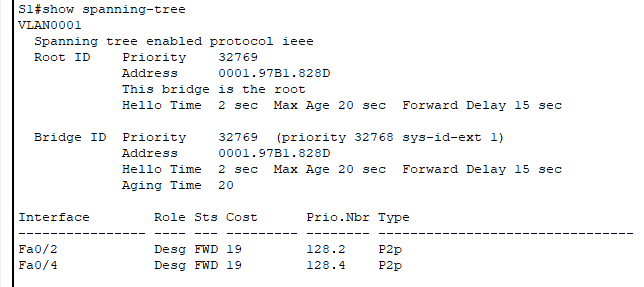
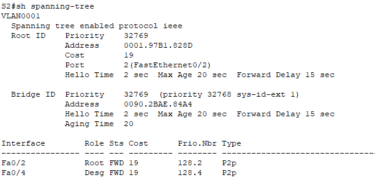
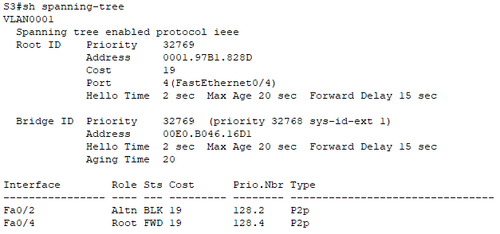
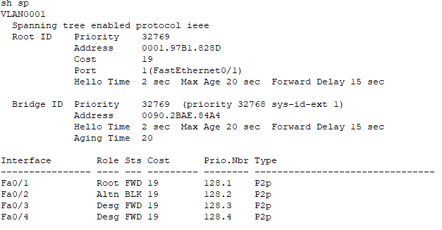
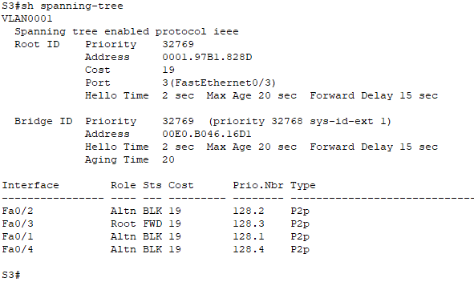

# STP

  

Включиаем порты F0/2 и F0/4 на всех коммутаторах 

 

##

  

##

  

**Какой коммутатор является корневым мостом?**    
S1  

Почему этот коммутатор был выбран протоколом spanning-tree в качестве корневого моста?  
Меньшее значение Bridge ID тк меньший МАС адрес  

**Какие порты на коммутаторе являются корневыми портами?**  
S1 - нет  
S2 – fa0/2  
S3 – fa0/4  

**Какой порт отображается в качестве альтернативного и в настоящее время заблокирован?**    
S3 fa0/2

**Почему протокол spanning-tree выбрал этот порт в качестве невыделенного (заблокированного) порта?**  
Он является резервным, альтернативным путем к корневому мосту и у него МАС больше, чем у коммутатора S2

**Почему протокол spanning-tree заменяет ранее заблокированный порт на назначенный порт и блокирует порт, который был назначенным портом на другом коммутаторе?**    
Изменилась стоимость пути к корневому коммутатору  

Включиаем порты F0/1 и F0/3 на всех коммутаторах

 
## 
  

**Какой порт выбран протоколом STP в качестве порта корневого моста на каждом коммутаторе некорневого моста?**     
S2 fa0/1  
S3 fa0/3

**Почему протокол STP выбрал эти порты в качестве портов корневого моста на этих коммутаторах?**  
Наименьший по номеру в сторону root  

**Вопросы для повторения**  
Какое значение протокол STP использует первым после выбора корневого моста, чтобы определить выбор порта?  
Root path cost  

Если первое значение на двух портах одинаково, какое следующее значение будет использовать протокол STP при выборе порта?  
Bridge id  

Если оба значения на двух портах равны, каким будет следующее значение, которое использует протокол STP при выборе порта?  
Port id 

