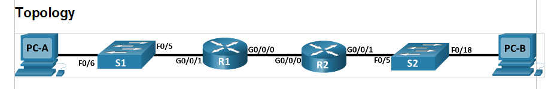

DHCPv4  

 

IP план согласно задания  
##
Subnet A  
192.168.1.0 /26 255.255.255.192  
Network	  192.168.1.0  
Broadcast 192.168.1.63  
Hostmin	  192.168.1.1  
Hostmax	  192.168.1.62  
Hosts 62  

Subnet B  
192.168.1.64 /27 255.255.255.224  
Network	  192.168.1.64  
Broadcast 192.168.1.95  
Hostmin	  192.168.1.65  
Hostmax	  192.168.1.94  
Hosts 30  

Subnet C  
192.168.1.96 /28 255.255.255.240  
Network	  192.168.1.96  
Broadcast 192.168.1.111  
Hostmin	  192.168.1.97  
Hostmax	  192.168.1.110  
Hosts 14

R1  
Gi0/0/0 10.0.0.1 255.255.255.252  
Gi0/0/1 -  
Gi0/0/1.100 192.168.1.1 255.255.255.192 - Subnet A  
Gi0/0/1.200 192.168.1.65 255.255.255.224 - Subnet B  
Gi0/0/1.1000 -   

R2  
Gi0/0/0 10.0.0.2 255.255.255.252  
Gi0/0/1 192.168.1.97 255.255.255.240 - Subnet C. helper 10.0.0.1  

S1  
Vlan 200 192.168.1.66 255.255.255.224

S2  
Vlan 1 192.168.1.98 255.255.255.240  

Конфигурируем сеть согласно ip плана
##
[S1](../Lab3/S1.txt)  
[R1](../Lab3/R1.txt)  
[R2](../Lab3/R2.txt)  
[S2](../Lab3/S2.txt) 

Настраиваем два пула DHCP на R1

ip dhcp excluded-address 192.168.1.1  
ip dhcp excluded-address 192.168.1.97  

ip dhcp pool R1_LAN  
 network 192.168.1.0 255.255.255.192  
 default-router 192.168.1.1  
 domain-name otus.com  

ip dhcp pool R2_LAN  
 network 192.168.1.96 255.255.255.240  
 default-router 192.168.1.97  
 domain-name otus.com  

 Настраиваем DHCP relay на R2  

 interface GigabitEthernet0/0/1  
 ip address 192.168.1.97 255.255.255.240  
 ip helper-address 10.0.0.1

PC-A успешно получает адресацию из подсети А  

PC-B успешно получает адресацию из подсети C  

DHCPv6

 

Конфигурируем два DHCPv6 пула и интерфейсы на R1  

ipv6 dhcp pool R1-STATELESS  
 dns-server 2001:DB8:ACAD::1  
 domain-name STATELESS.com    

 interface GigabitEthernet0/0/1  
 no ip address  
 duplex auto  
 speed auto  
 ipv6 address FE80::1 link-local  
 ipv6 address 2001:DB8:ACAD:1::1/64  
 ipv6 nd other-config-flag  
 ipv6 dhcp server R1-STATELESS    

 ipv6 dhcp pool R2-STATEFUL  
 address prefix 2001:db8:acad:3:aaa::/80 lifetime 172800 86400  
 dns-server 2001:DB8:ACAD::254  
 domain-name STATEFUL.com  

 interface GigabitEthernet0/0/0  
 no ip address  
 duplex auto  
 speed auto  
 ipv6 address FE80::1 link-local  
 ipv6 address 2001:DB8:ACAD:2::1/64  
 ipv6 dhcp server R2-STATEFUL  

 PC-A успешно получает данные о DNS из пула R1-STATELESS

 

К сожалению, в cisco packet tracer нет комманды ipv6 dhcp relay destination. По этой причине настроить получение ipv6 адреса из пула R2-STATEFUL на PC-B не удалось.
Далее использовать CPT не буду)

