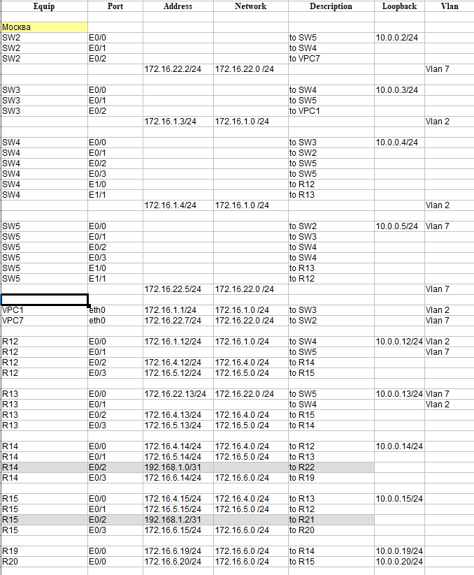

Проектирование сети

Задание:

1. Разработать и задокументировать адресное пространство для лабораторного стенда.
Настроить ip адреса на каждом активном порту.  
2. Настроить каждый VPC в каждом офисе в своем VLAN.  
3. Настроить VLAN/Loopbackup interface управления для сетевых устройств.
4. Настроить сети офисов так, чтобы не возникало broadcast штормов, а использование линков было максимально оптимизировано. 
5. Использовать IPv4. IPv6 по желанию.

Топология сети

 

Адресация сети

 

 

Адреса 172.Х.Х.Х/24 будут в последнем октете иметь цифру, совпадающую с номером маршрутизатора на схеме.  
Loopback адреса из сети 10.0.0.0/24  
Адресация на ptp линках 192.168.1.X/31  
Связность между VPC и роутерами в соотвествующих vlan настроена.

Конфигурационные файлы

[R12](../Lab4/R12.txt)  
[R13](../Lab4/R13.txt)  
[R14](../Lab4/R14.txt)  
[R15](../Lab4/R15.txt)  
[R16](../Lab4/R16.txt)  
[R17](../Lab4/R17.txt)    
[R18](../Lab4/R18.txt)  
[R19](../Lab4/R19.txt)  
[R20](../Lab4/R20.txt)  
[R21](../Lab4/R21.txt)  
[R22](../Lab4/R22.txt)  
[R23](../Lab4/R23.txt)  
[R24](../Lab4/R24.txt)  
[R25](../Lab4/R25.txt)  
[R26](../Lab4/R26.txt)  
[R27](../Lab4/R27.txt)    
[R28](../Lab4/R28.txt)   
[R32](../Lab4/R32.txt)   
[SW2](../Lab4/SW2.txt)   
[SW3](../Lab4/SW3.txt)   
[SW4](../Lab4/SW4.txt)   
[SW5](../Lab4/SW5.txt)   
[SW9](../Lab4/SW9.txt)    
[SW10](../Lab4/SW10.txt)  
[SW29](../Lab4/SW29.txt)  

