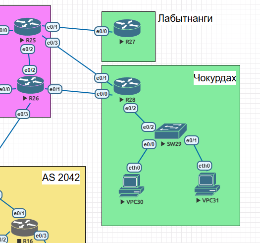

Маршрутизация на основе политик (PBR) 

 

Задание:

1. Настроить политику маршрутизации для сетей офиса.
2. Распределить трафик между двумя линками с провайдером.
3. Настроить отслеживание линка через технологию IP SLA.
4. Настройть для офиса Лабытнанги маршрут по-умолчанию.

На R28 создадим маршрутную карту Balance для распределения трафика от VPC30 на R26 и VPC31 на R25.  

route-map Balance permit 10  
 match ip address Vlan30  
 set ip default next-hop 192.168.1.16  
  
route-map Balance permit 20  
 match ip address Vlan31  
 set ip default next-hop 192.168.1.14  

 Создадим access листы Vlan30 для VPC30 и Vlan31 для VPC31

ip access-list standard Vlan30  
 permit 172.18.1.0 0.0.0.255  
ip access-list standard Vlan31  
 permit 172.18.2.0 0.0.0.255  

 Применим route-map на входящем интерфейсе R28

 interface Ethernet0/2
 description to SW29
 no ip address
 ip policy route-map Balance

