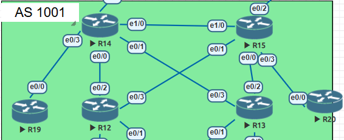

## OSPF. Фильтрация   

  

## Задание

## 1. Маршрутизаторы R14-R15 находятся в зоне 0 - backbone.

Между R14 и R15 создадим прямой линк тк area 0 не должна прерываться. На R14 и R15 включаем ospf и добавляем его на соответствующие интерфейсы.

router ospf 1

interface Ethernet1/0  
 description to R15  
 ip address 172.16.7.14 255.255.255.0  
 ip ospf 1 area 0  

interface Ethernet1/0  
 description to R14  
 ip address 172.16.7.15 255.255.255.0  
 ip ospf 1 area 0  

Соседство full присутствует:  
R14#sh ip ospf neighbor

Neighbor ID     Pri   State           Dead Time   Address         Interface
10.0.0.15         1   FULL/DR         00:00:35    172.16.7.15     Ethernet1/0

## 2. Маршрутизаторы R12-R13 находятся в зоне 10. Дополнительно к маршрутам должны получать маршрут по умолчанию.
На R12, R13, R14 и R15 создаем stub area 10 и включаем ее на интерфейсах.
Пример конфигурации на R12:

interface Loopback0  
 ip address 10.0.0.12 255.255.255.0  
 ip ospf network point-to-point  
 ip ospf 1 area 10  

interface Ethernet0/2  
 description to R14  
 ip address 172.16.4.12 255.255.255.0  
 ip ospf 1 area 10  

interface Ethernet0/3  
 description to R15  
 ip address 172.16.5.12 255.255.255.0  
 ip ospf 1 area 10  

 router ospf 1  
 area 10 stub  

Получаем все маршруты и дефолт на R14 и R15

R12#sh ip route

Gateway of last resort is 172.16.5.15 to network 0.0.0.0

O*IA  0.0.0.0/0 [110/11] via 172.16.5.15, 00:27:06, Ethernet0/3  
                [110/11] via 172.16.4.14, 00:26:56, Ethernet0/2  
      10.0.0.0/8 is variably subnetted, 2 subnets, 2 masks  
C        10.0.0.0/24 is directly connected, Loopback0  
L        10.0.0.12/32 is directly connected, Loopback0  
      172.16.0.0/16 is variably subnetted, 9 subnets, 2 masks  
C        172.16.1.0/24 is directly connected, Ethernet0/0.2  
L        172.16.1.12/32 is directly connected, Ethernet0/0.2  
C        172.16.4.0/24 is directly connected, Ethernet0/2  
L        172.16.4.12/32 is directly connected, Ethernet0/2  
C        172.16.5.0/24 is directly connected, Ethernet0/3  
L        172.16.5.12/32 is directly connected, Ethernet0/3  
O IA     172.16.6.0/24 [110/20] via 172.16.4.14, 00:26:56, Ethernet0/2  
O IA     172.16.7.0/24 [110/20] via 172.16.5.15, 00:27:06, Ethernet0/3  
                       [110/20] via 172.16.4.14, 00:26:56, Ethernet0/2  
O IA     172.16.8.0/24 [110/20] via 172.16.5.15, 00:27:06, Ethernet0/3  

## 3. Маршрутизатор R19 находится в зоне 101 и получает только маршрут по умолчанию.
На R14 отключаем передачу LSA 3 на R19 и создаем totally stub area 101.  

R14:  
interface Ethernet0/3  
 description to R19  
 ip address 172.16.6.14 255.255.255.0  
 ip ospf 1 area 101  

 router ospf 1  
 area 10 stub  
 area 101 stub no-summary  

R19:  
interface Ethernet0/0  
 description to R14  
 ip address 172.16.6.19 255.255.255.0  
 ip ospf 1 area 101  

router ospf 1  
 area 101 stub  

Получаем только дефолт, остальные коннектед сети.   
 R19#show ip route

O*IA  0.0.0.0/0 [110/11] via 172.16.6.14, 00:42:00, Ethernet0/0  
      10.0.0.0/8 is variably subnetted, 2 subnets, 2 masks  
C        10.0.0.0/24 is directly connected, Loopback0  
L        10.0.0.19/32 is directly connected, Loopback0  
      172.16.0.0/16 is variably subnetted, 2 subnets, 2 masks  
C        172.16.6.0/24 is directly connected, Ethernet0/0  
L        172.16.6.19/32 is directly connected, Ethernet0/0  

## 4. Маршрутизатор R20 находится в зоне 102 и получает все маршруты, кроме маршрутов до сетей зоны 101.
На R15 создаем префикс-лист R20 с запретом сети 172.16.6.0/24 и применяем его в area 102  

R15:  
interface Ethernet0/3  
 description to R20  
 ip address 172.16.8.15 255.255.255.0  
 ip ospf 1 area 102  

ip prefix-list R19 seq 5 deny 172.16.6.0/24  
ip prefix-list R19 seq 10 permit 0.0.0.0/0 le 32  

router ospf 1  
 area 10 stub  
 area 102 filter-list prefix R19 in  
 
R20:  

router ospf 1  

interface Loopback0  
 ip address 10.0.0.20 255.255.255.0  
 ip ospf network point-to-point  
 ip ospf 1 area 102  

interface Ethernet0/0  
 description to R15  
 ip address 172.16.8.20 255.255.255.0  
 ip ospf 1 area 102  

Не получаем префикс 172.16.6.0/24 на R20

 R20#sh ip route  

Gateway of last resort is not set  

      10.0.0.0/8 is variably subnetted, 2 subnets, 2 masks  
C        10.0.0.0/24 is directly connected, Loopback0  
L        10.0.0.20/32 is directly connected, Loopback0  
      172.16.0.0/16 is variably subnetted, 5 subnets, 2 masks  
O IA     172.16.4.0/24 [110/20] via 172.16.8.15, 00:58:52, Ethernet0/0  
O IA     172.16.5.0/24 [110/20] via 172.16.8.15, 00:58:52, Ethernet0/0  
O IA     172.16.7.0/24 [110/20] via 172.16.8.15, 00:58:52, Ethernet0/0  
C        172.16.8.0/24 is directly connected, Ethernet0/0  
L        172.16.8.20/32 is directly connected, Ethernet0/0  

