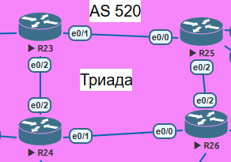

## ISIS  

  

## Задание:

1. Настроите IS-IS в ISP Триада.
2. R23 и R25 находятся в зоне 2222.
3. R24 находится в зоне 24.
4. R26 находится в зоне 26.

Включаем протокол на маршрутизаторах командой router isis.

Настраиваем NET  

на R23 net 49.2222.0100.0000.0023.00  
на R25 net 49.2222.0100.0000.0025.00  
на R24 net 49.0024.0100.0000.0024.00  
на R26 net 49.0026.0100.0000.0026.00

Добавляем протокол isis на интерфейсах командой ip router isis.

Конфигурационные файлы  

[R23](../Lab7/R23.txt)   
[R24](../Lab7/R24.txt)   
[R25](../Lab7/R25.txt)   
[R26](../Lab7/R26.txt)    

## Проверка:

R23#show clns  
Global CLNS Information:  
  3 Interfaces Enabled for CLNS  
  Configuration Timer: 60, Default Holding Timer: 300, Packet Lifetime 64  
  ERPDU's requested on locally generated packets  
  Running IS-IS in IP-only mode (CLNS forwarding not allowed)  
  NET: 49.2222.1000.0000.0023.00  

R23#show isis neighbors

System Id      Type Interface   IP Address      State Holdtime Circuit Id
R24            L2   Et0/2       172.19.2.24     UP    9        R24.02           
R25            L1   Et0/1       172.19.1.25     UP    9        R25.01           
R25            L2   Et0/1       172.19.1.25     UP    7        R25.01 

R23#show isis topology

IS-IS TID 0 paths to level-1 routers
System Id            Metric     Next-Hop             Interface   SNPA
R23                  --
R25                  10         R25                  Et0/1       aabb.cc01.9000

IS-IS TID 0 paths to level-2 routers  
System Id            Metric     Next-Hop             Interface   SNPA  
R23                  --
R24                  10         R24                  Et0/2       aabb.cc01.8020  
R25                  10         R25                  Et0/1       aabb.cc01.9000  
R26                  20         R24                  Et0/2       aabb.cc01.8020  
                                R25                  Et0/1       aabb.cc01.9000  

R23#sh ip route  

Gateway of last resort is not set    
10.0.0.0/8 is variably subnetted, 2 subnets, 2 masks  
C        10.0.0.0/24 is directly connected, Loopback0  
L        10.0.0.23/32 is directly connected, Loopback0  
      172.19.0.0/16 is variably subnetted, 4 subnets, 2 masks  
C        172.19.1.0/24 is directly connected, Ethernet0/1  
L        172.19.1.23/32 is directly connected, Ethernet0/1  
C        172.19.2.0/24 is directly connected, Ethernet0/2  
L        172.19.2.23/32 is directly connected, Ethernet0/2  
      192.168.1.0/24 is variably subnetted, 2 subnets, 2 masks  
C        192.168.1.10/31 is directly connected, Ethernet0/0  
L        192.168.1.10/32 is directly connected, Ethernet0/0  

Отношения соседства isis на всех маршрутизаторах присутствует.

