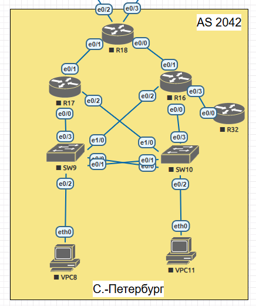

## EIGRP  

  

Задание:

1. В офисе С.-Петербург настроить EIGRP.
2. R32 получает только маршрут по умолчанию.
3. R16-17 анонсируют только суммарные префиксы.
4. Использовать EIGRP named-mode для настройки сети.

На всех роутерах включаем именованный режим командой  
router eigrp EIGRP  
Создаем автономную систему:  
address-family ipv4 unicast autonomous-system 1  
Включаем интерфейсы, на которых будет работать eigrp:  
network 172.17.0.0 0.0.255.255  

На R16 coздаем  address-family интерфейс в сторону R32 c маршрутом по умолчанию. 

router eigrp EIGRP  
 address-family ipv4 unicast autonomous-system 1  
  af-interface Ethernet0/3  
   summary-address 0.0.0.0 0.0.0.0  
  exit-af-interface  

  R32 получает только маршрут по умолчанию:  
  R32#sh ip route  
Gateway of last resort is 172.17.4.16 to network 0.0.0.0  
D*    0.0.0.0/0 [90/1536000] via 172.17.4.16, 00:35:00, Ethernet0/0  
      10.0.0.0/32 is subnetted, 1 subnets  
C        10.0.0.32 is directly connected, Loopback0  
      172.17.0.0/16 is variably subnetted, 2 subnets, 2 masks  
C        172.17.4.0/24 is directly connected, Ethernet0/0  
L        172.17.4.32/32 is directly connected, Ethernet0/0  

На R16 и R17 создаем address-family интерфейс в сторону R18 с суммарным префиксом:

router eigrp EIGRP  
 address-family ipv4 unicast autonomous-system 1  
  af-interface Ethernet0/1  
   summary-address 172.17.0.0 255.255.0.0  
  exit-af-interface  

R18 получает по eigrp только суммаорный машрут :

Router#sh ip route
      10.0.0.0/32 is subnetted, 1 subnets  
C        10.0.0.18 is directly connected, Loopback0  
      172.17.0.0/16 is variably subnetted, 5 subnets, 3 masks  
D        172.17.0.0/16 [90/1536000] via 172.17.2.16, 00:43:26,Ethernet0/0  
                       [90/1536000] via 172.17.0.17, 00:43:26, Ethernet0/1  

Конфигурационные файлы  

[R16](../Lab8/R16.txt)   
[R17](../Lab8/R17.txt)   
[R18](../Lab8/R18.txt)   
[R32](../Lab8/R32.txt) 

